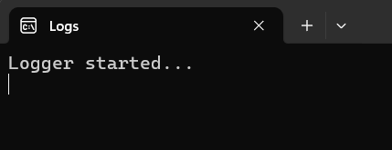

## Console Logger
Console Logger provides a streamlined and feature rich approach to logging to the console. It can serve as a utility for other libraries to log to the console.

## Features
### Disposable Consoles
```cs
using var logger = new Logger();
logger.LogInformation("Successfully processed request");
```
**Note:** If the process already had a console window attached, disposing the logger wouldn't close it. But if the process didn't already have a console window attached and a new one was created when the logger was initialized, disposing the logger would close the console window.


### Conventional Logging With Extra Features

#### Various Log Levels
- Debug
- Information
- Error
- Warning
- Critical

#### Console Titles
When initializing a logger you can specify the title.

```cs
using var logger = new Logger(consoleTitle: "Logs");
logger.LogInformation("Logger started...");
```

The above snippet will result in the result in the image below.



**Note:** If the process already had a console window attached, the older title is stored and set back when the logger instance is disposed.

#### Logging with Sound

#### PseudoConsoles (TBD)