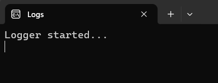

## Console Logger
Console Logger provides a streamlined and feature rich approach to logging to the console. It can serve as a utility for other libraries to log to the console and now that scripting is going to be seen more in the C# language; this is a must have in your toolbox.

## Features
### Disposable Consoles
```cs
using var logger = new Logger();
logger.LogInformation("Successfully processed request");
```
**Note:** If the process already had a console window attached, disposing the logger wouldn't close it. But if the process didn't already have a console window attached and a new one was created when the logger was initialized, disposing the logger would close the console window.


### Conventional Logging With Extra Features

#### Various Log Levels
- Debug
- Information
- Error
- Warning
- Critical

#### Console Titles
When initializing a logger you can specify the title.

```cs
using var logger = new Logger(consoleTitle: "Logs");
logger.LogInformation("Logger started...");
```

The above snippet will result in the result in the image below.



**Note:** If the process already had a console window attached, the older title is stored and set back when the logger instance is disposed.

#### Logging with Sound
The logger allows you to log with sound. The frequency and duration of the sound is determined by the passed sound option or the log level in the call chain.

```cs

using var logger = new Logger(consoleTitle: "Logs");

logger.LogInformation("Logger started...")
		.WithSound(Sounds.Info);
```

**Note**: For `Critical` log level the duration is set to the max integer, however you can change this using the `WithSound()` method to modify the `SoundOption`.

#### PseudoConsoles (TBD)